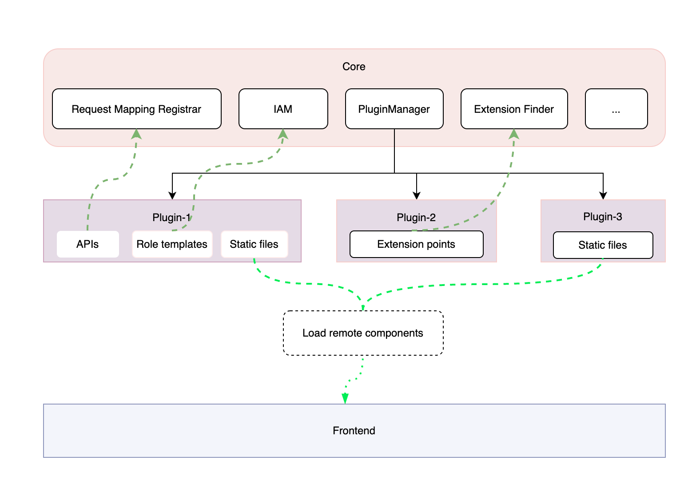

## 插件化功能设计

实现 Halo 插件化系统，以便对核心功能进行扩展，在不缺失主要功能的同时防止 Core 过大。插件能力有助于社区生态的构建。

### 目标

后端插件化

- 后端支持 API 拓展机制，提供统一的 API 聚合，通过 core 的访问控制模块（IAM） 进行统一鉴权。
- 支持扩展点机制，插件通过实现 core 中暴露的扩展点接口来增强 core 的能力，如扩展附件存储提供者。
- 插件允许通过 core 提供的数据持久化机制来进行数据操作（CRUD）。
- 插件允许调用 core 提供的公开接口对 core 的数据进行操作

前端插件化

- 前端项目支持插件化，可通过插件在各级导航栏插入新的功能入口，实现功能页面的动态添加。

- 通过固定协议加载插件中提供的前端页面或JS来扩展前端功能

公共目标

- 插件管理：提供可视化的插件管理机制，支持插件的安装、卸载、启用、停用、配置、升级
- 插件仓库：提供插件的打包、发布机制，提供内置的插件仓库。
- 插件框架：提供插件开发、打包、发布相关的脚手架，提供完善的插件开发文档。

### 非目标

- 插件安全检查
- 插件代码风格检查

### 背景和动机

目前 1.0 版本中社区提出了很多非普适功能的 issue，为了控制 core 的大小会挑选重要的功能进行实现， 这对使用者来说很不方便。

如果增加了插件化能力，社区可以根据自己的需要进行插件开发以扩展核心功能，使用者也可以在插件仓库查找自己需要的插件来满足功能。

该功能的实现会很大程度的提高社区活跃度并壮大社区，同时很多在 1.0 版本中加入的许多功能都可以抽取为独立插件以减小 core 的大小，使用者可以按需插拔功能使 halo 更加灵活。

### 设计

#### 术语

- **Extension Point**
  - 由 Halo 定义的用于添加特定功能的接口。
  - 扩展点应该在服务的核心功能和它所认为的集成之间的交叉点上。
  - 扩展点是对服务的扩充，但不是影响服务的核心功能：区别在于，如果没有其核心功能，服务就无法运行，而扩展点对于特定的配置可能至关重要该服务最终是可选的。
  - 扩展点应该小且可组合，并且在相互配合使用时，可为 Halo 提供比其各部分总和更大的价值。
- **Extension**
  - Extension Point（扩展点）的一种具体实现

#### Backend

##### 描述

插件启用时由 PluginManager 负责加载，包括 :

- APIs: 委托给 Request mapping registrar 管理
- ExtensionPoint：委托给 Extension Finder管理
- Static files
- 类似manifest和role template的yaml
- Listeners：委托给 PluginListenerRegistrar 管理
- Spring bean components：委托给 SpringExtensionFactory 创建 Instance如果是单类则由 SingletonSpringExtensionFactory 管理



##### 资源配置

**plugin-manifest**

```yaml
apiVersion: extensions.halo.run/v1
kind: Plugin
metadata:
  # 'name' must match the filename of the manifest. The name defines how
  # the plugin is invoked
  name: plugin-1
  labels:
    extensions.guqing.xyz/category: attachment
spec:
  # 'version' is a valid semantic version string (see semver.org). Note the prefix 'v' is required.
  version: v0.0.1
  requires: >=v2.0.0
  author: guqing
  pluginClass: xyz.guqing.plugin.potatoes.PotatoesApp
  pluginDependencies:
   - plugin-2
  # 'homepage' usually links to the GitHub repository of the plugin
  homepage: https://github.com/guqing/halo-plugin-1
  # 'shortDescription' explains what the plugin does in only a few words
  shortDescription: "this is a test plugin"
  description: "Tell me more about this plugin."
  license: MIT
```

**plugin role templates**

如果需要对插件提供的 API 进行权限控制，可以定义 role template，当插件启用时会被加载以使用 Halo 的权限控制体系进行统一的 API 权限控制。

```yaml
apiVersion: halo.run/v1
kind: Role
metadata:
  name: role-manage-plugin-apis
  labels:
    guqing.xyz/role-template: true
  annotations:
    guqing.xyz/dependencies: ["role-template-view-plugin-apis"]
    guqing.xyz/module: "Test Plugin"
    guqing.xyz/alias-name: "Test Plugin"
rules:
  - apiGroups: ["plugin1.guqing.xyz"]
    resources: ["plugin-tests"]
    verbs: ["*"]
```

##### ExtensionPoint 插件

Halo 使用 [Java 插件框架 (PF4J)](https://github.com/pf4j/pf4j) 来表示服务的*扩展点* 接口。您可以创建一个插件来实现扩展点中声明的方法。基于扩展点创建插件有很多优点：

- 这是最简单的 - 使用`@Extension`注解并实现你选择的扩展点中声明的方法
- Halo 将插件加载到隔离的类路径中
- 它的维护工作量最少
- Halo 的更新不太可能破坏你的插件

这里有一个 [POC可供预览](https://github.com/guqing/halo-plugin-experimental/tree/main/core/src/main/java/run/halo/app/extensions)

#### Frontend

TBD

